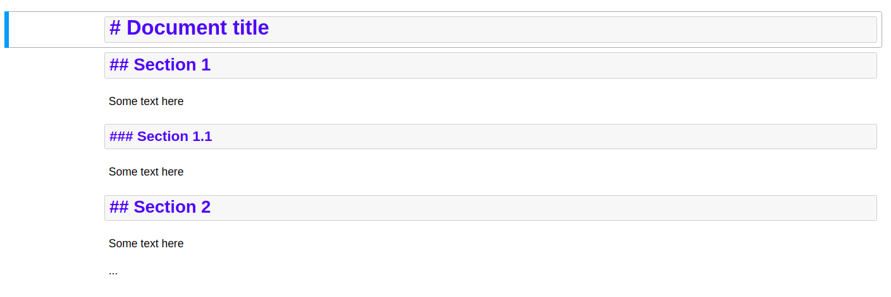

*Disclaimer:

The script is developed from RStudio Team's `convert_ipynb` [code](https://rmarkdown.rstudio.com/docs/reference/convert_ipynb.html). This simple app is developed for my personal purpose to ease the process of converting multiple `ipynb` into a tidy pdf.

## Markdown Formatting

Please follow the formatting below:

1. Heading
  - `#`: Indicates the **Title** of the document. DO NOT use this heading for sectioning.
  - `##`, `###`, ...: Marks the section heading



2. Bullets
  Please add breaks after paragraph and before bullet! Example:


3. Others:
  - Do **not** use `%matplotlib inline`
  
## How to Use

### Step 1: Convert .ipynb to .Rmd file

1. Open the R project

2. In your R console, run `to_Rmd()` function from `R/converter.R` script. You can define your prefered input/output directory but the default location is in `/documents/` (input & output).
 
```r
source('R/converter.R')
to_Rmd()
```

### Step 2. Compile your pdf

1. Make sure all files (including images attached, related script, etc.) related to the notebook are included in `/documents` 
2. Open `parent.Rmd`
3. Adjust YAML options & chunk titles
4. Knit it to pdf
